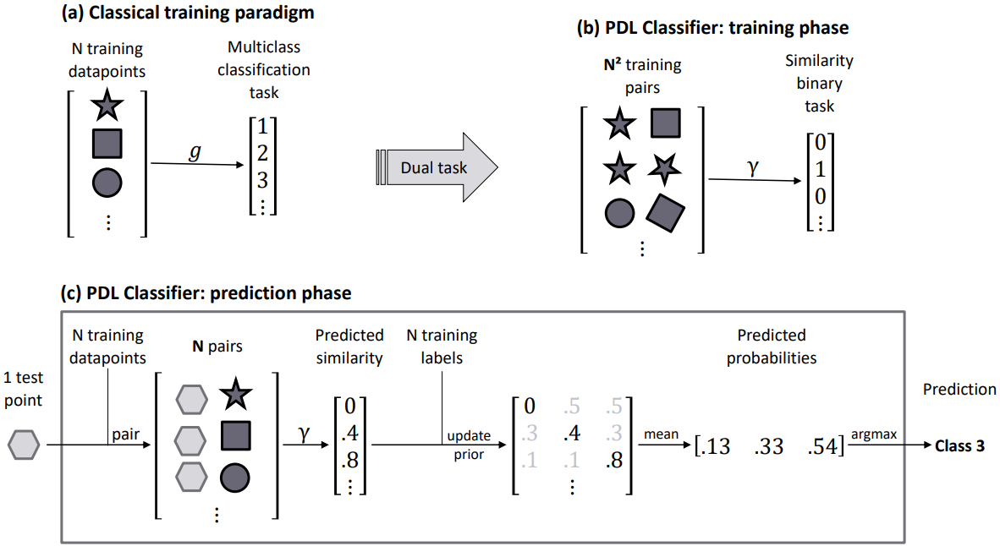
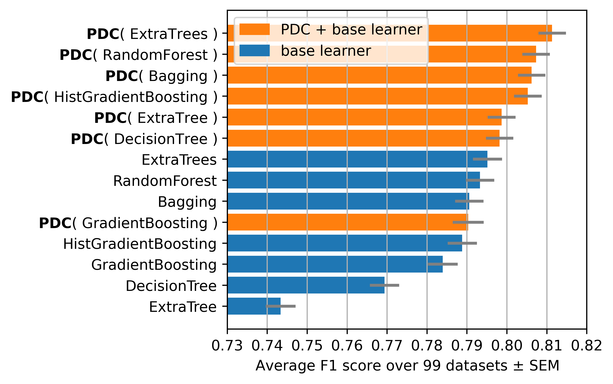
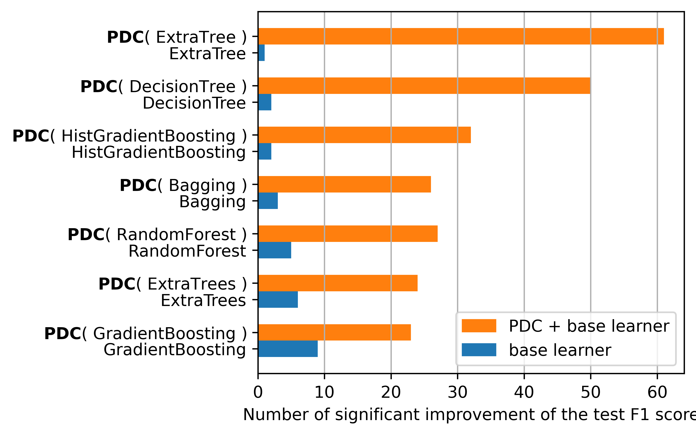
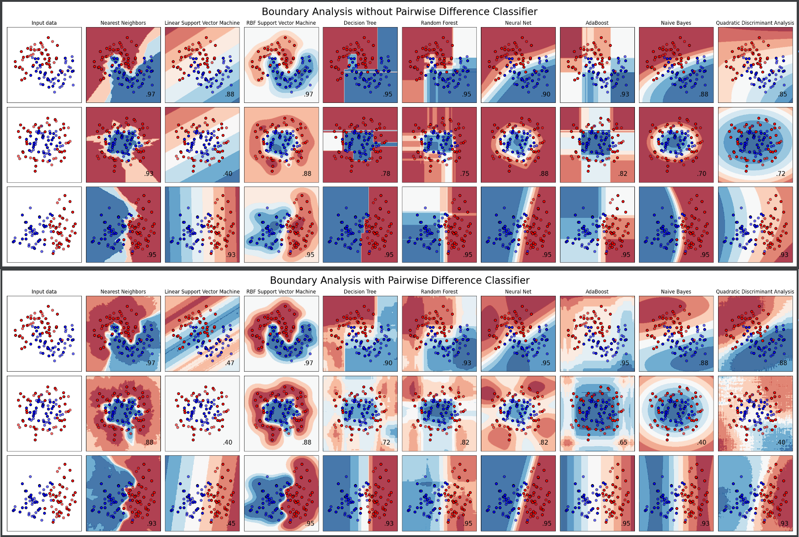

# Pairwise difference learning library (pdll)
[](https://pepy.tech/project/pdll)

**Pairwise Difference Learning** (PDL) library is a python module. It contains a scikit-learn compatible implementation of PDL Classifier, as described in [Belaid et al. 2024](https://arxiv.org/abs/2406.20031) 

**PDL Classifier** or PDC is a meta learner that can reduce multiclass classification problem into a binary classification problem (similar/different).

[//]: # (**PDL Regressor** or PDR is a meta learner that solves regression problem by learning the difference.)

## Installation
To install the package, run the following command:
```shell
pip install -U pdll
```

[comment]: <> (todo conda link)

## Usage
```python
from pdll import PairwiseDifferenceClassifier

from sklearn.ensemble import RandomForestClassifier
from sklearn.datasets import make_blobs

# Generate random data with 2 features, 10 points, and 3 classes
X, y = make_blobs(n_samples=10, n_features=2, centers=3, random_state=0)

pdc = PairwiseDifferenceClassifier(estimator=RandomForestClassifier())
pdc.fit(X, y)
print('score:', pdc.score(X, y))

y_pred = pdc.predict(X)
proba_pred = pdc.predict_proba(X)
```
Please consult `examples/` directory for more examples.


## How does it work?
The PDL algorithm works by transforming the multiclass classification problem into a binary classification problem. The algorithm works as follows:

### Example 1: Graphical abstract


### Example 2: PDC trained on the Iris dataset
<details>
  <summary>Clic to show</summary>
We provide a minimalist classification example using the Iris dataset. The dataset is balanced, so the prior probabilities of each of the 3 classes are equal:
p(Setosa) = p(Versicolour) = p(Virginica) = 1/3


**Three Anchor Points**
- Flower 1: `y1 = Setosa`
- Flower 2: `y2 = Versicolour`
- Flower 3: `y3 = Virginica`

**One Query Point**
- Flower Q: `yq` (unknown target)

**Pairwise Predictions**
The model predicts the likelihood that both points have a similar class:
- g_sym(Flower Q, Flower 1) = 0.6
- g_sym(Flower Q, Flower 2) = 0.3
- g_sym(Flower Q, Flower 3) = 0.0


Given the above data, the first step is to update the priors.

**Posterior using Flower 1:**
- p_post,1(Setosa) = 0.6
- p_post,1(Versicolour) = (1/3 * (1 - 0.6)) / (1 - 1/3) = 0.2
- p_post,1(Virginica) = (1/3 * (1 - 0.6)) / (1 - 1/3) = 0.2


Similarly, we calculate for anchors 2 and 3:
- p_post,2(Setosa) = 0.35
- p_post,2(Versicolour) = 0.30
- p_post,2(Virginica) = 0.35

- p_post,3(Setosa) = 0.5
- p_post,3(Versicolour) = 0.5
- p_post,3(Virginica) = 0.0


**Averaging over the three predictions:**


Finally, the predicted class is the most likely prediction:

ŷ_q = arg max_{y ∈ Y} p_post(y) = Setosa


</details>

## Evaluation
To reproduce the experiment of the paper, please run `run_benchmark.py` with a base learner and a dataset number, between 0 and 99. Example:

`python run_benchmark.py --model DecisionTreeClassifier --data 0`

Scores will be stored in `./results/tmp/` directory.

### Experiment
We use 99 datasets from the OpenML repository. We compare the performance of the PDC algorithm with 7 base learners. We use the macro F1 score as a metric.
The search space is inspired from TPOT a state-of-the-art library in optimizing Sklearn pipelines

<details>
  <summary>Description of the search space per estimator</summary>

| Estimator              | # parameters | # combinations |
|------------------------|--------------|----------------|
| DecisionTree           | 4            | 350            |
| RandomForest           | 7            | 1000           |
| ExtraTree              | 6            | 648            |
| HistGradientBoosting   | 6            | 486            |
| Bagging                | 6            | 96             |
| ExtraTrees             | 7            | 1000           |
| GradientBoosting       | 5            | 900            |

</details>

<details>
  <summary>Search space per estimator</summary>

| Estimator                  | Parameter              | Values                                                 |
|----------------------------|------------------------|--------------------------------------------------------|
| **DecisionTreeClassifier** | criterion              | gini, entropy                                          |
|                            | max depth              | None, 1, 2, 4, 6, 8, 11                                |
|                            | min samples split      | 2, 4, 8, 16, 21                                        |
|                            | min samples leaf       | 1, 2, 4, 10, 21                                        |
| **RandomForestClassifier** | criterion              | gini, entropy                                          |
|                            | min samples split      | 2, 4, 8, 16, 21                                        |
|                            | max features           | sqrt, 0.05, 0.17, 0.29, 0.41, 0.52, 0.64, 0.76, 0.88, 1.0 |
|                            | min samples leaf       | 1, 2, 4, 10, 21                                        |
|                            | bootstrap              | True, False                                            |
| **ExtraTreeClassifier**    | criterion              | gini, entropy                                          |
|                            | min samples split      | 2, 5, 10                                               |
|                            | min samples leaf       | 1, 2, 4                                                |
|                            | max features           | sqrt, log2, None                                       |
|                            | max leaf nodes         | None, 2, 12, 56                                        |
|                            | min impurity decrease  | 0.0, 0.1, 0.5                                          |
| **HistGradientBoostingClassifier** | max iter           | 100, 10                                                |
|                            | learning rate          | 0.1, 0.01, 1                                           |
|                            | max leaf nodes         | 31, 3, 256                                             |
|                            | min samples leaf       | 20, 4, 64                                              |
|                            | l2 regularization      | 0, 0.01, 0.1                                           |
|                            | max bins               | 255, 2, 64                                             |
| **BaggingClassifier**      | n estimators           | 10, 5, 100, 256                                        |
|                            | max samples            | 1.0, 0.5                                               |
|                            | max features           | 0.5, 0.9, 1.0                                          |
|                            | bootstrap              | True, False                                            |
|                            | bootstrap features     | False, True                                            |
| **ExtraTreesClassifier**   | criterion              | gini, entropy                                          |
|                            | max features           | sqrt, 0.05, 0.17, 0.29, 0.41, 0.52, 0.64, 0.76, 0.88, 1.0 |
|                            | min samples split      | 2, 4, 8, 16, 21                                        |
|                            | min samples leaf       | 1, 2, 4, 10, 21                                        |
|                            | bootstrap              | False, True                                            |
| **GradientBoostingClassifier** | learning rate       | 0.1, 0.01, 1                                           |
|                            | min samples split      | 2, 4, 8, 16, 21                                        |
|                            | min samples leaf       | 1, 2, 4, 10, 21                                        |
|                            | subsample              | 1.0, 0.05, 0.37, 0.68                                  |
|                            | max features           | None, 0.15, 0.68                                       |

</details>


<details>
  <summary>OpenML benchmark datasets</summary>

|   data_id |   NumberOfClasses |   NumberOfInstances |   NumberOfFeatures |   NumberOfSymbolicFeatures |   NumberOfFeatures_post_processing |   MajorityClassSize |   MinorityClassSize |
|----------:|------------------:|--------------------:|-------------------:|---------------------------:|-----------------------------------:|--------------------:|--------------------:|
|        43 |                 2 |                 306 |                  4 |                          2 |                                  3 |                 225 |                  81 |
|        48 |                 3 |                 151 |                  6 |                          3 |                                  5 |                  52 |                  49 |
|        59 |                 2 |                 351 |                 35 |                          1 |                                 34 |                 225 |                 126 |
|        61 |                 3 |                 150 |                  5 |                          1 |                                  4 |                  50 |                  50 |
|       164 |                 2 |                 106 |                 58 |                         58 |                                 57 |                  53 |                  53 |
|       333 |                 2 |                 556 |                  7 |                          7 |                                  6 |                 278 |                 278 |
|       377 |                 6 |                 600 |                 61 |                          1 |                                 60 |                 100 |                 100 |
|       444 |                 2 |                 132 |                  4 |                          4 |                                  3 |                  71 |                  61 |
|       464 |                 2 |                 250 |                  3 |                          1 |                                  2 |                 125 |                 125 |
|       475 |                 4 |                 400 |                  6 |                          5 |                                  5 |                 100 |                 100 |
|       714 |                 2 |                 125 |                  5 |                          3 |                                  4 |                  76 |                  49 |
|       717 |                 2 |                 508 |                 11 |                          1 |                                 10 |                 286 |                 222 |
|       721 |                 2 |                 200 |                 11 |                          1 |                                 10 |                 103 |                  97 |
|       733 |                 2 |                 209 |                  7 |                          1 |                                  6 |                 153 |                  56 |
|       736 |                 2 |                 111 |                  4 |                          1 |                                  3 |                  58 |                  53 |
|       744 |                 2 |                 250 |                  6 |                          1 |                                  5 |                 141 |                 109 |
|       750 |                 2 |                 500 |                  8 |                          1 |                                  7 |                 254 |                 246 |
|       756 |                 2 |                 159 |                 16 |                          1 |                                 15 |                 105 |                  54 |
|       766 |                 2 |                 500 |                 51 |                          1 |                                 50 |                 262 |                 238 |
|       767 |                 2 |                 475 |                  4 |                          3 |                                  3 |                 414 |                  61 |
|       768 |                 2 |                 100 |                 26 |                          1 |                                 25 |                  55 |                  45 |
|       773 |                 2 |                 250 |                 26 |                          1 |                                 25 |                 126 |                 124 |
|       779 |                 2 |                 500 |                 26 |                          1 |                                 25 |                 267 |                 233 |
|       782 |                 2 |                 120 |                  3 |                          1 |                                  2 |                  63 |                  57 |
|       784 |                 2 |                 140 |                  4 |                          2 |                                  3 |                  70 |                  70 |
|       788 |                 2 |                 186 |                 61 |                          1 |                                 60 |                 109 |                  77 |
|       792 |                 2 |                 500 |                  6 |                          1 |                                  5 |                 298 |                 202 |
|       793 |                 2 |                 250 |                 11 |                          1 |                                 10 |                 135 |                 115 |
|       811 |                 2 |                 264 |                  3 |                          2 |                                  2 |                 163 |                 101 |
|       812 |                 2 |                 100 |                 26 |                          1 |                                 25 |                  53 |                  47 |
|       814 |                 2 |                 468 |                  3 |                          1 |                                  2 |                 256 |                 212 |
|       824 |                 2 |                 500 |                 11 |                          1 |                                 10 |                 274 |                 226 |
|       850 |                 2 |                 100 |                 51 |                          1 |                                 50 |                  51 |                  49 |
|       853 |                 2 |                 506 |                 14 |                          2 |                                 13 |                 297 |                 209 |
|       860 |                 2 |                 380 |                  3 |                          1 |                                  2 |                 195 |                 185 |
|       863 |                 2 |                 250 |                 11 |                          1 |                                 10 |                 133 |                 117 |
|       870 |                 2 |                 500 |                  6 |                          1 |                                  5 |                 267 |                 233 |
|       873 |                 2 |                 250 |                 51 |                          1 |                                 50 |                 142 |                 108 |
|       877 |                 2 |                 250 |                 51 |                          1 |                                 50 |                 137 |                 113 |
|       879 |                 2 |                 500 |                 26 |                          1 |                                 25 |                 304 |                 196 |
|       880 |                 2 |                 284 |                 11 |                          1 |                                 10 |                 142 |                 142 |
|       889 |                 2 |                 100 |                 26 |                          1 |                                 25 |                  50 |                  50 |
|       895 |                 2 |                 222 |                  3 |                          1 |                                  2 |                 134 |                  88 |
|       896 |                 2 |                 500 |                 26 |                          1 |                                 25 |                 280 |                 220 |
|       902 |                 2 |                 147 |                  7 |                          5 |                                  6 |                  78 |                  69 |
|       906 |                 2 |                 400 |                  8 |                          1 |                                  7 |                 207 |                 193 |
|       909 |                 2 |                 400 |                  8 |                          1 |                                  7 |                 203 |                 197 |
|       911 |                 2 |                 250 |                  6 |                          1 |                                  5 |                 140 |                 110 |
|       915 |                 2 |                 315 |                 14 |                          4 |                                 13 |                 182 |                 133 |
|       918 |                 2 |                 250 |                 51 |                          1 |                                 50 |                 135 |                 115 |
|       925 |                 2 |                 323 |                  5 |                          1 |                                  4 |                 175 |                 148 |
|       932 |                 2 |                 100 |                 51 |                          1 |                                 50 |                  56 |                  44 |
|       933 |                 2 |                 250 |                 26 |                          1 |                                 25 |                 136 |                 114 |
|       935 |                 2 |                 250 |                 11 |                          1 |                                 10 |                 140 |                 110 |
|       936 |                 2 |                 500 |                 11 |                          1 |                                 10 |                 272 |                 228 |
|       937 |                 2 |                 500 |                 51 |                          1 |                                 50 |                 282 |                 218 |
|       969 |                 2 |                 150 |                  5 |                          1 |                                  4 |                 100 |                  50 |
|       973 |                 2 |                 178 |                 14 |                          1 |                                 13 |                 107 |                  71 |
|       974 |                 2 |                 132 |                  5 |                          1 |                                  4 |                  81 |                  51 |
|      1005 |                 2 |                 214 |                 10 |                          1 |                                  9 |                 138 |                  76 |
|      1011 |                 2 |                 336 |                  8 |                          1 |                                  7 |                 193 |                 143 |
|      1012 |                 2 |                 194 |                 29 |                         27 |                                 28 |                 125 |                  69 |
|      1054 |                 2 |                 161 |                 40 |                          1 |                                 39 |                 109 |                  52 |
|      1063 |                 2 |                 522 |                 22 |                          1 |                                 21 |                 415 |                 107 |
|      1065 |                 2 |                 458 |                 40 |                          1 |                                 39 |                 415 |                  43 |
|      1073 |                 2 |                 274 |                  9 |                          1 |                                  8 |                 140 |                 134 |
|      1100 |                 3 |                 478 |                 11 |                          5 |                                 10 |                 247 |                  90 |
|      1115 |                 3 |                 151 |                  7 |                          5 |                                  6 |                  52 |                  49 |
|      1413 |                 3 |                 150 |                  5 |                          1 |                                  4 |                  50 |                  50 |
|      1467 |                 2 |                 540 |                 21 |                          1 |                                 20 |                 494 |                  46 |
|      1480 |                 2 |                 583 |                 11 |                          2 |                                 10 |                 416 |                 167 |
|      1488 |                 2 |                 195 |                 23 |                          1 |                                 22 |                 147 |                  48 |
|      1490 |                 2 |                 182 |                 13 |                          1 |                                 12 |                 130 |                  52 |
|      1499 |                 3 |                 210 |                  8 |                          1 |                                  7 |                  70 |                  70 |
|      1510 |                 2 |                 569 |                 31 |                          1 |                                 30 |                 357 |                 212 |
|      1511 |                 2 |                 440 |                  9 |                          2 |                                  8 |                 298 |                 142 |
|      1523 |                 3 |                 310 |                  7 |                          1 |                                  6 |                 150 |                  60 |
|      1554 |                 5 |                 500 |                 13 |                          5 |                                 12 |                 192 |                  43 |
|      1556 |                 2 |                 120 |                  7 |                          6 |                                  6 |                  61 |                  59 |
|      1600 |                 2 |                 267 |                 45 |                          1 |                                 44 |                 212 |                  55 |
|      4329 |                 2 |                 470 |                 17 |                         14 |                                 16 |                 400 |                  70 |
|     40663 |                 5 |                 399 |                 33 |                         21 |                                 32 |                  96 |                  44 |
|     40681 |                 2 |                 128 |                  7 |                          7 |                                  6 |                  64 |                  64 |
|     41568 |                 3 |                 150 |                  5 |                          1 |                                  4 |                  50 |                  50 |
|     41977 |                 2 |                 156 |                 91 |                          1 |                                 90 |                  98 |                  58 |
|     41978 |                 2 |                 156 |                 81 |                          1 |                                 80 |                  94 |                  62 |
|     42011 |                 3 |                 150 |                  5 |                          1 |                                  4 |                  50 |                  50 |
|     42021 |                 3 |                 150 |                  5 |                          1 |                                  4 |                  50 |                  50 |
|     42026 |                 3 |                 150 |                  5 |                          1 |                                  4 |                  50 |                  50 |
|     42051 |                 3 |                 150 |                  5 |                          1 |                                  4 |                  50 |                  50 |
|     42066 |                 3 |                 150 |                  5 |                          1 |                                  4 |                  50 |                  50 |
|     42071 |                 3 |                 150 |                  5 |                          1 |                                  4 |                  50 |                  50 |
|     42186 |                 3 |                 150 |                  5 |                          1 |                                  4 |                  50 |                  50 |
|     42700 |                 3 |                 150 |                  5 |                          1 |                                  4 |                  50 |                  50 |
|     43859 |                 3 |                 150 |                  5 |                          1 |                                  4 |                  50 |                  50 |
|     44149 |                 2 |                 296 |                 14 |                          1 |                                 18 |                 159 |                 137 |
|     44151 |                 3 |                 149 |                  5 |                          0 |                                  4 |                  50 |                  49 |
|     44344 |                 3 |                 150 |                  5 |                          1 |                                  4 |                  50 |                  50 |
|     45711 |                 2 |                 530 |                 14 |                          3 |                                 13 |                 354 |                 176 |


</details>

### Score comparison





### 2D datasets Examples

Here we see the difference in the learned patterns between PDL and the base learner. In case PDL is compatible with the base learner (DecisionTree, RandomForest) then the scores improves. In case the base learner is not compatible with PDL (SVC, AdaBoost, ...) then the scores gets lower. 


## Reference
Please cite us if you use this library in your research:
```
@article{belaid2024pairwise,
  title={Pairwise Difference Learning for Classification},
  author={Belaid, Mohamed Karim and Rabus, Maximilian and H{\"u}llermeier, Eyke},
  journal={arXiv preprint arXiv:2406.20031},
  year={2024}
}
```
The first commit correspond to the original implementation of the PDC algorithm


**Acknowledgments:** We would like to thank [Tim Wibiral](https://github.com/twibiral), [Dorra ElMekki](https://github.com/DorraElMekki), Viktor Bengs, Muhammad Zeeshan Anwer,  Muhammad Hossein Shaker, Alireza Javanmardi, [Patrick Kolpaczki](https://github.com/kolpaczki), and [Maximilian Muschalik](https://github.com/mmschlk) for their early comments on this work.
We also acknowledge LRZ and IDIADA for computational resources.


